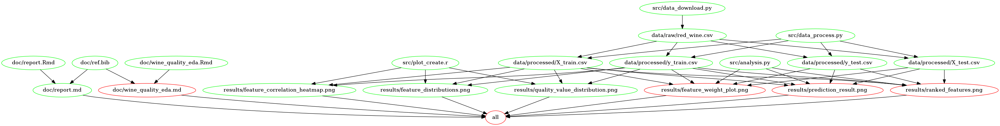

# Data Science workflow project: Wine Quality Prediction

The milestone project is for the course DSCI522 Data Science Workflows from the Master of Data Science program at the University of British Columbia. This repository includes data, scripts and other analysis-related files. The project predicts the wine quality based on data obtained from the [University of California Irvine Machine learning Repository](http://archive.ics.uci.edu/ml/datasets/Wine+Quality). 

## Introduction

According to [British Columbia Wine Institute](https://winebc.com/industry/media/quick-facts/), the BC wine industry contributes approximately $2.8 billion annually to British Columbia’s economy. To facilitate the development of BC wine industry, stakeholders are seeking a better way to improve the wine production and selling process with new techniques applied. Globally, wine certification and quality assessment are essential given this context. 

Wine quality assessment basically consists of two parts: the lab test and the sensory test. Physicochemical lab tests generally characterize wine based on features such as density, pH value, acidity, sugar, and alcohol, etc. While the sensory test is mainly relying on qualified experts. Due to the low interpretation of human sense, the relationship between sensory tests and the lab tests is somehow compared to a black box. Therefore, the industry is curious about how ‘good’ the wine is, given the physicochemical lab test results. 


[Image courtesy of Getty](https://253qv1sx4ey389p9wtpp9sj0-wpengine.netdna-ssl.com/wp-content/uploads/2019/02/Wine_Cert_Programs_GettyImages_636693944_1920x1280.jpg)


## Report

The final report can be accessed [here](doc/report.md).

## Usage



#### 1\. Using Docker

*note - the instructions in this section also depends on running this in
a unix shell (e.g., terminal or Git Bash)*

To replicate the analysis, install
[Docker](https://www.docker.com/get-started). Then clone this GitHub
repository and run the following command at the command line/terminal
from the root directory of this project:

    docker run --rm -v $(pwd):/DSCI_522_GROUP_311 ht2567306/testr1 make -C '/DSCI_522_GROUP_311' all

To reset the repo to a clean state, with no intermediate or results
files, run the following command at the command line/terminal from the
root directory of this project:

    docker run --rm -v $(pwd):/DSCI_522_GROUP_311 ht2567306/testr1 make -C '/DSCI_522_GROUP_311' clean

#### 2\. Without using Docker

To replicate the analysis, clone this GitHub repository, install the [dependencies](#dependencies) listed below, and run the following commands at the command line/terminal from the root directory of this project:
```
make all
```
To reset the repo to a clean state, with no intermediate or results
files, run the following command at the command line/terminal from the
root directory of this project: 
```
make clean
```

## Dependencies

- Python 3.7.3 and Python packages:
  - docopt==0.6.2
  - requests==2.22.0
  - pandas==0.24.2
  - numpy==1.17.0
  - altair==4.0.0
  - pyjanitor==0.18.1
  - scikit-learn ==0.21
  - selenium==3.141.0

- R version 3.6.1 and R packages:
  - testthat==2.2.1
  - docopt==0.6.1
  - knitr==1.26
  - tidyverse==1.2.1
  - janitor==1.2.0
  - reshape2==1.4.3
  - viridis==0.5.1
  - caret==6.0-84
  
- Others:
  - ChromeDriver==79.0.3945.36

## Reference

P. Cortez, A. Cerdeira, F. Almeida, T. Matos and J. Reis. Modeling wine preferences by data mining from physicochemical properties. In Decision Support Systems, Elsevier, 47(4):547-553, 2009. 


