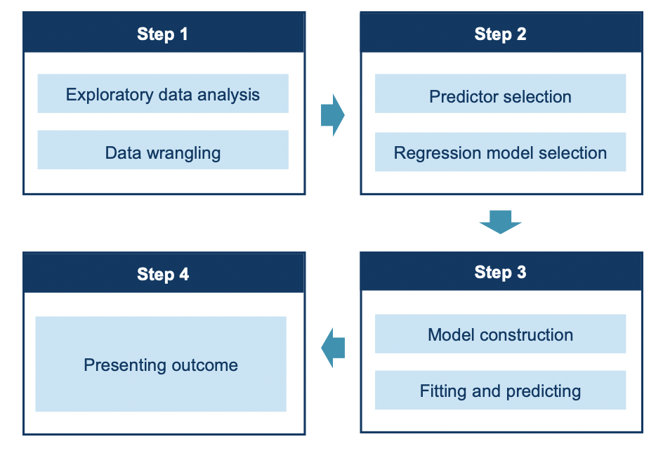

## Proposal

### Research Question

The specific questions to be addressed are:

- **Given the Physicochemical lab test, how is the wine quality? (primary predictive question)**
- What feature most strongly predicts whether a wine is good or not?
- What is the average pH value of wines rated as good?

### Data Description 

The dataset used in our milestone project is related to the Portuguese "Vinho Verde" wine. It was sourced from the UCI Machine Learning Repository and can be found [here]( http://archive.ics.uci.edu/ml/datasets/Wine+Quality). There are 1599 observations in the dataset. The 11 features from physicochemical lab tests and one response from the sensory test are listed as below: 

**Input variables/features:**

- fixed acidity 
- volatile acidity 
- citric acid 
- residual sugar 
- chlorides 
- free sulfur dioxide 
- total sulfur dioxide 
- density 
- pH 
- sulphates 
- alcohol 

**Output variable/response:**

- quality (score between 0 and 10) 

### Analysis Plan

To answer the predictive question, regression models will be applied to predict the wine quality. As shown in the flow chart below, firstly, exploratory data analysis will be performed to find out the existence of data imbalance, and the distributions of features. In the second step, we will compare multiple regression models. In terms of the data splitting, we will split 20% of data as our test data before fitting the regression model. To optimize our model, hyperparameter optimization will be implemented. 

### Research output

At the end of the project, a report including visualization, model-building procedures is expected. Metrics such as the precision and accuracy will also be included in our final report.