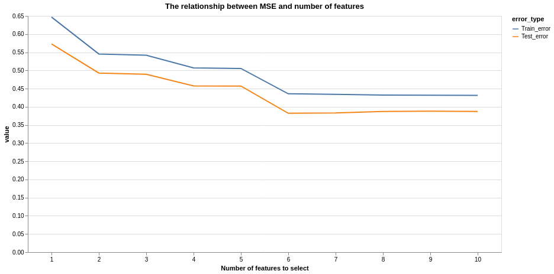
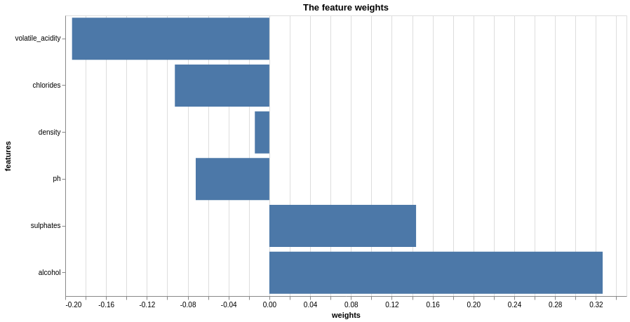
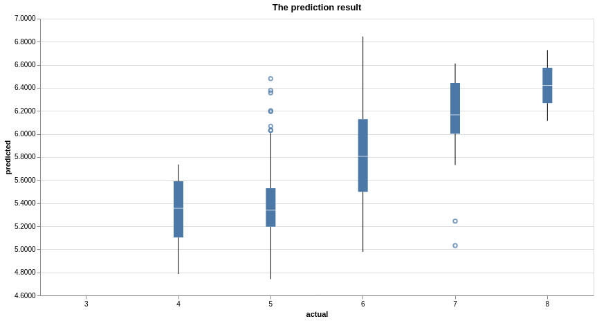

```{r setup, include=FALSE}
knitr::opts_chunk$set(echo = FALSE)
library(tidyverse)
library(knitr)
```

## Summary

To answer the question about predicting the red wine quality based on physiochemical properties, we propose a prediction model using linear regression algorithm. Based on the 1599 samples with 11 original physiochemical features, we deployed recursive feature elimination (RFE)  to select features by recursively considering smaller and smaller sets of features. It turned out that 6 physiochemical properties is significant contributing to a better model performance. Building such model is valuable to support oenologist wine tasting evaluations and improve wine production. 


## Introduction

According to [British Columbia Wine Institute]( https://winebc.com/industry/media/quick-facts/), the BC wine industry contributes approximately $2.8 billion annually to British Columbia’s economy. To facilitate the development of BC wine industry, stakeholders are seeking a better way to improve the wine production and selling process with new techniques applied. Globally, wine certification and quality assessment are essential given this context.

Wine quality assessment basically consists of two parts: the lab test and the sensory test. Physicochemical lab tests generally characterize wine based on features such as density, pH value, acidity, sugar, and alcohol, etc. While the sensory test mainly relies on qualified experts. Due to the low interpretation of human sense, the relationship between sensory tests and the lab tests is somehow compared to a black box. The industry is curious about how ‘good’ the wine is, given the physicochemical lab test results.  Therefore, a model integrating physiochemical lab tests and sensory tests is helpful in addressing the industry concern, supporting the wine evaluation and thus improving local wine production. 

## Methodology

The data used in this project is obtained from the [University of California Irvine Machine learning Repository]( http://archive.ics.uci.edu/ml/datasets/Wine+Quality)[@cortez2009modeling][@Dua2019].  It contains 1599 samples from red wine produced in Portugal. Each sample represents 11 physiochemical properties (features) from lab tests and also the sensory results (response) ranging from 0 to 10.  


The Analysis portion of this project is done by Python. A standard scaler is used to scale all features into the same scale. To perform feature selection, we use scikit-learn's linear regression as an estimator and perform recursive feature selection. Regarding the number of features to select, we try the number from 1 to 11 (sum of features), we found that if we continute to add more features after 6, the model will stop improving. Therefore, we perform linear regression on the top six features by using scikit-learn's linear regression model.

The following Python packages were used in this project:

### R 

- testthat[@testthat]

- docopt[@docopt]

- knitr[@knitr]

- tidyverse[@tidyverse]

- janitor[@janitor]

- reshape2[@reshape2]

- viridis[@viridis]

- caret[@caret]

### Python

- docoptpython[@docoptpython]

- request[@request]

- pandas[@pandas]

- numpy[@numpy]

- altair[@altair]

- pyjanitor[@pyjanitor]

- scikit-learn[@sklearn]

## Results


`Recursive Feature Selection (RFE)` from `sklearn` package was deployed to select features. This job is recursively considering smaller and smaller sets of features. First, the estimator is trained on the initial set of features and the importance of each feature is obtained either through a `coef_ attribute` or through a `feature_importances_ attribute`. Then, the least important features are pruned from current set of features. That procedure is recursively repeated on the pruned set until the desired number of features to select is eventually reached.
 	 
  
Specificly, as shown in figure below, it is noticed that when number of features is six, we can get a minimum error for both training and testing.


```{r feature ranking, echo=FALSE, fig.cap="Figure 1. The relationship between MSE and number of featurs", out.width = '100%'}

```

Therefore, we run `sklearn`'s `Recursive Feature Selection` again with the `n_features_to_select` explicitly set to 6, then the algorithm will fit linear regression models, remove the feature that has the smallest weight. `sklearn` recursively does this until the number of the features decrease to 6. The following are the 6 features remained eventually and their corresponding weights in ascending order:

```{r feature weight, echo=FALSE, fig.cap="Figure 2. Feature weight", out.width = '90%'}

```

To find out how our model performs, the following plot was created with the actual values on the x-axis and the predicted values on the y-axis:

```{r prediction results, echo=FALSE, fig.cap="Figure 3. Prediction results", out.width = '90%'}

```

Based on the plot, we can see that our model predicts well on the wines whose grades are ranging from 5 and 6. However, for the low-graded wines, the model tends to over-estimating (eg. grade 4), while for high-graded wines (wine with grades 7 and 8), the model tends to under-estimating.

## Discussion:

Even without domain expertise, we all know that those physiochemical properties should be good indicators of the wine qualities. The fact that the model performed well on middle range proves that the selected features are useful and a linear regression is a reasonable model to choose.

The reason that it did not perform well on low-graded and high-graded wines may be due to exitence of imbalance in  the original training set. There are more examples of the middle-graded wines in the dataset. In other words, our model can not 'learn' enough from the low-graded and high-graded wines.

Some potential improvements can be simply oversampling the high-graded and low-graded wines to supplement the origianl dataset or to undersample the middle-graded wines in the original dataset.

## References
