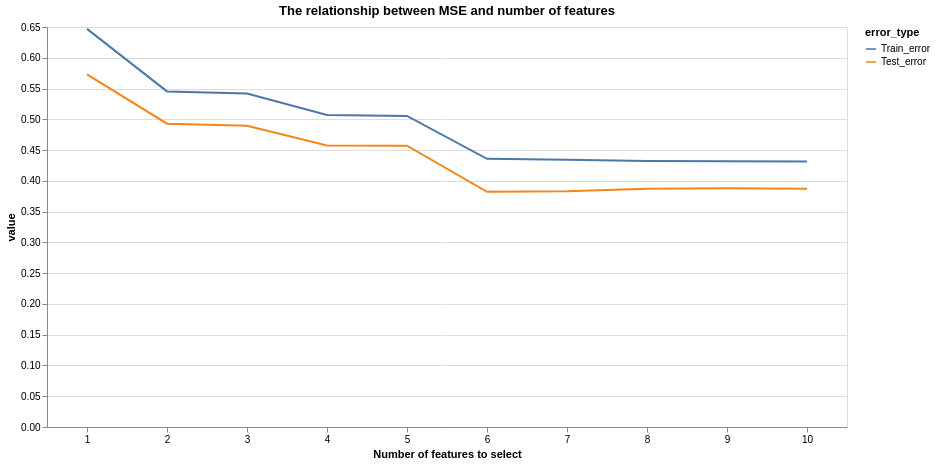
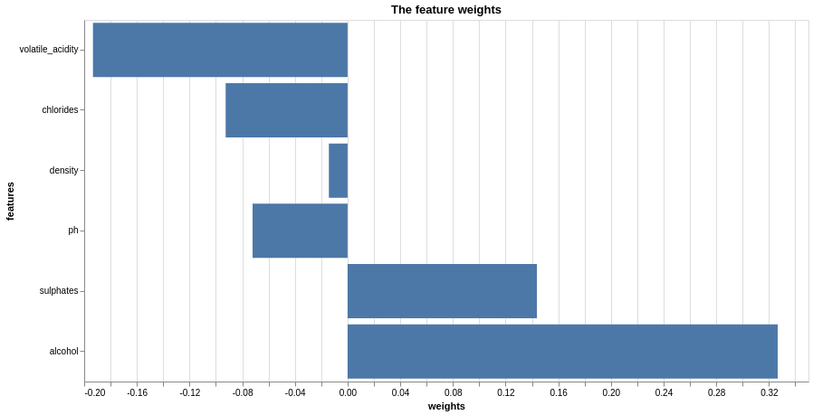
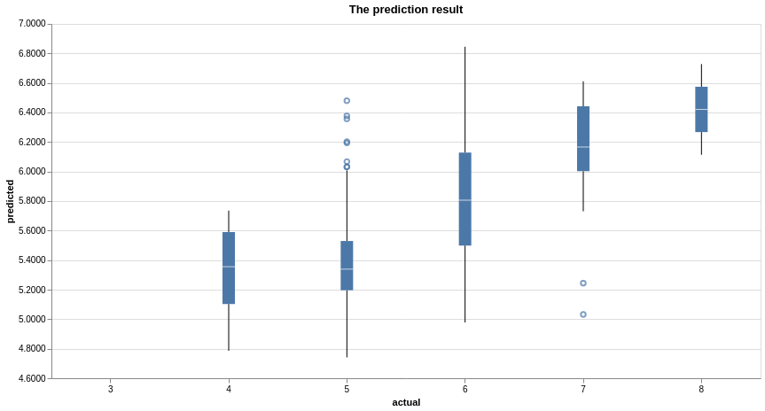

The red wine quality prediction
================
DSCI 522 Group 311: Tao Huang, Hanying Zhang, Xugang Zhong
2020-01-24

## Summary

To answer the question about predicting the red wine quality based on
physiochemical properties, we propose a prediction model using linear
regression algorithm. Based on the 1599 samples with 11 original
physiochemical features, we deployed recursive feature elimination (RFE)
to select features by recursively considering smaller and smaller sets
of features. It turned out that 6 physiochemical properties is
significant contributing to a better model performance. Building such
model is valuable to support oenologist wine tasting evaluations and
improve wine production.

## Introduction

According to [British Columbia Wine
Institute](https://winebc.com/industry/media/quick-facts/), the BC wine
industry contributes approximately $2.8 billion annually to British
Columbia’s economy. To facilitate the development of BC wine industry,
stakeholders are seeking a better way to improve the wine production and
selling process with new techniques applied. Globally, wine
certification and quality assessment are essential given this context.

Wine quality assessment basically consists of two parts: the lab test
and the sensory test. Physicochemical lab tests generally characterize
wine based on features such as density, pH value, acidity, sugar, and
alcohol, etc. While the sensory test mainly relies on qualified experts.
Due to the low interpretation of human sense, the relationship between
sensory tests and the lab tests is somehow compared to a black box. The
industry is curious about how ‘good’ the wine is, given the
physicochemical lab test results. Therefore, a model integrating
physiochemical lab tests and sensory tests is helpful in addressing the
industry concern, supporting the wine evaluation and thus improving
local wine production.

## Methodology

The data used in this project is obtained from the [University of
California Irvine Machine learning
Repository](http://archive.ics.uci.edu/ml/datasets/Wine+Quality)(Cortez
et al. 2009)(Dua and Graff 2017). It contains 1599 samples from red wine
produced in Portugal. Each sample represents 11 physiochemical
properties (features) from lab tests and also the sensory results
(response) ranging from 0 to 10.

The Analysis portion of this project is done by Python. A standard
scaler is used to scale all features into the same scale. To perform
feature selection, we use scikit-learn’s linear regression as an
estimator and perform recursive feature selection. Regarding the number
of features to select, we try the number from 1 to 11 (sum of features),
we found that if we continute to add more features after 6, the model
will stop improving. Therefore, we perform linear regression on the top
six features by using scikit-learn’s linear regression model.

The following Python packages were used in this project:

### R

  - testthat(Wickham 2019)

  - docopt(de Jonge 2018)

  - knitr(Xie 2020)

  - tidyverse(Wickham 2017)

  - janitor(Firke 2019)

  - reshape2(Wickham 2007)

  - viridis(Garnier 2018)

  - caret(Kuhn 2020)

### Python

  - docoptpython(Keleshev 2014)

  - request(Reiz 2019)

  - pandas(Safia Abdalla 2019)

  - numpy(Walt, Colbert, and Varoquaux 2011)

  - altair(VanderPlas et al. 2018)

  - pyjanitor(Ma 2019)

  - scikit-learn(Buitinck et al. 2013)

## Results

`Recursive Feature Selection (RFE)` from `sklearn` package was deployed
to select features. This job is recursively considering smaller and
smaller sets of features. First, the estimator is trained on the initial
set of features and the importance of each feature is obtained either
through a `coef_ attribute` or through a `feature_importances_
attribute`. Then, the least important features are pruned from current
set of features. That procedure is recursively repeated on the pruned
set until the desired number of features to select is eventually
reached.

Specificly, as shown in figure below, it is noticed that when number of
features is six, we can get a minimum error for both training and
testing.

Figure 1. The relationship between MSE and number of featurs

Therefore, we run `sklearn`’s `Recursive Feature Selection` again with
the `n_features_to_select` explicitly set to 6, then the algorithm will
fit linear regression models, remove the feature that has the smallest
weight. `sklearn` recursively does this until the number of the features
decrease to 6. The following are the 6 features remained eventually and
their corresponding weights in ascending
order:

Figure 2. Feature weight

To find out how our model performs, the following plot was created with
the actual values on the x-axis and the predicted values on the
y-axis:

Figure 3. Prediction results

Based on the plot, we can see that our model predicts well on the wines
whose grades are ranging from 5 and 6. However, for the low-graded
wines, the model tends to over-estimating (eg. grade 4), while for
high-graded wines (wine with grades 7 and 8), the model tends to
under-estimating.

## Discussion:

Even without domain expertise, we all know that those physiochemical
properties should be good indicators of the wine qualities. The fact
that the model performed well on middle range proves that the selected
features are useful and a linear regression is a reasonable model to
choose.

The reason that it did not perform well on low-graded and high-graded
wines may be due to exitence of imbalance in the original training set.
There are more examples of the middle-graded wines in the dataset. In
other words, our model can not ‘learn’ enough from the low-graded and
high-graded wines.

Some potential improvements can be simply oversampling the high-graded
and low-graded wines to supplement the origianl dataset or to
undersample the middle-graded wines in the original dataset.

## References

Buitinck, Lars, Gilles Louppe, Mathieu Blondel, Fabian Pedregosa,
Andreas Mueller, Olivier Grisel, Vlad Niculae, et al. 2013. “API Design
for Machine Learning Software: Experiences from the Scikit-Learn
Project.” In *ECML Pkdd Workshop: Languages for Data Mining and Machine
Learning*, 108–22.

Cortez, Paulo, António Cerdeira, Fernando Almeida, Telmo Matos, and José
Reis. 2009. “Modeling Wine Preferences by Data Mining from
Physicochemical Properties.” *Decision Support Systems* 47 (4).
Elsevier: 547–53.

de Jonge, Edwin. 2018. *Docopt: Command-Line Interface Specification
Language*. <https://CRAN.R-project.org/package=docopt>.

Dua, Dheeru, and Casey Graff. 2017. “UCI Machine Learning Repository.”
University of California, Irvine, School of Information; Computer
Sciences. <http://archive.ics.uci.edu/ml>.

Firke, Sam. 2019. *Janitor: Simple Tools for Examining and Cleaning
Dirty Data*. <https://CRAN.R-project.org/package=janitor>.

Garnier, Simon. 2018. *Viridis: Default Color Maps from ’Matplotlib’*.
<https://github.com/sjmgarnier/viridis>.

Keleshev, Vladimir. 2014. *Docopt: Command-Line Interface Description
Language*. <https://github.com/docopt/docopt>.

Kuhn, Max. 2020. *Caret: Classification and Regression Training*.
<https://CRAN.R-project.org/package=caret>.

Ma, Eric. 2019. *Pyjanitor: Tools for Cleaning Pandas Dataframes*.
<https://pypi.org/project/pyjanitor>.

Reiz, Kenneth. 2019. *Request: Requests Allows You to Send Organic,
Grass-Fed Http/1.1 Requests, Without the Need for Manual Labor.*
<https://pypi.org/project/requests/#history>.

Safia Abdalla, Joris Van den Bossche, Tom Augspurger. 2019. *Pandas:
Powerful Python Data Analysis Toolkit*.
<https://github.com/pandas-dev/pandas>.

VanderPlas, Jacob, Brian Granger, Jeffrey Heer, Dominik Moritz, Kanit
Wongsuphasawat, Arvind Satyanarayan, Eitan Lees, Ilia Timofeev, Ben
Welsh, and Scott Sievert. 2018. “Altair: Interactive Statistical
Visualizations for Python.” *Journal of Open Source Software*, December.
The Open Journal. <https://doi.org/10.21105/joss.01057>.

Walt, Stéfan van der, S Chris Colbert, and Gael Varoquaux. 2011. “The
Numpy Array: A Structure for Efficient Numerical Computation.”
*Computing in Science & Engineering* 13 (2). IEEE Computer Society:
22–30.

Wickham, Hadley. 2007. “Reshaping Data with the reshape Package.”
*Journal of Statistical Software* 21 (12): 1–20.
<http://www.jstatsoft.org/v21/i12/>.

———. 2017. *Tidyverse: Easily Install and Load the ’Tidyverse’*.
<https://CRAN.R-project.org/package=tidyverse>.

———. 2019. *Testthat: Unit Testing for R*.
<https://CRAN.R-project.org/package=testthat>.

Xie, Yihui. 2020. *Knitr: A General-Purpose Package for Dynamic Report
Generation in R*. <https://CRAN.R-project.org/package=knitr>.

