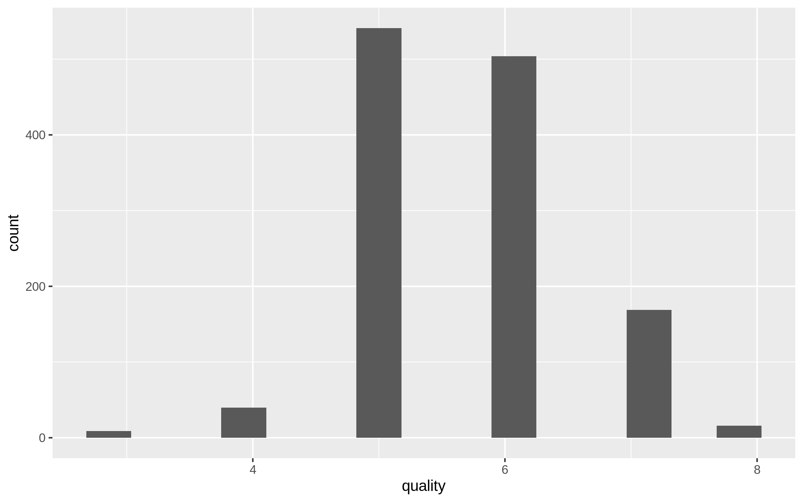
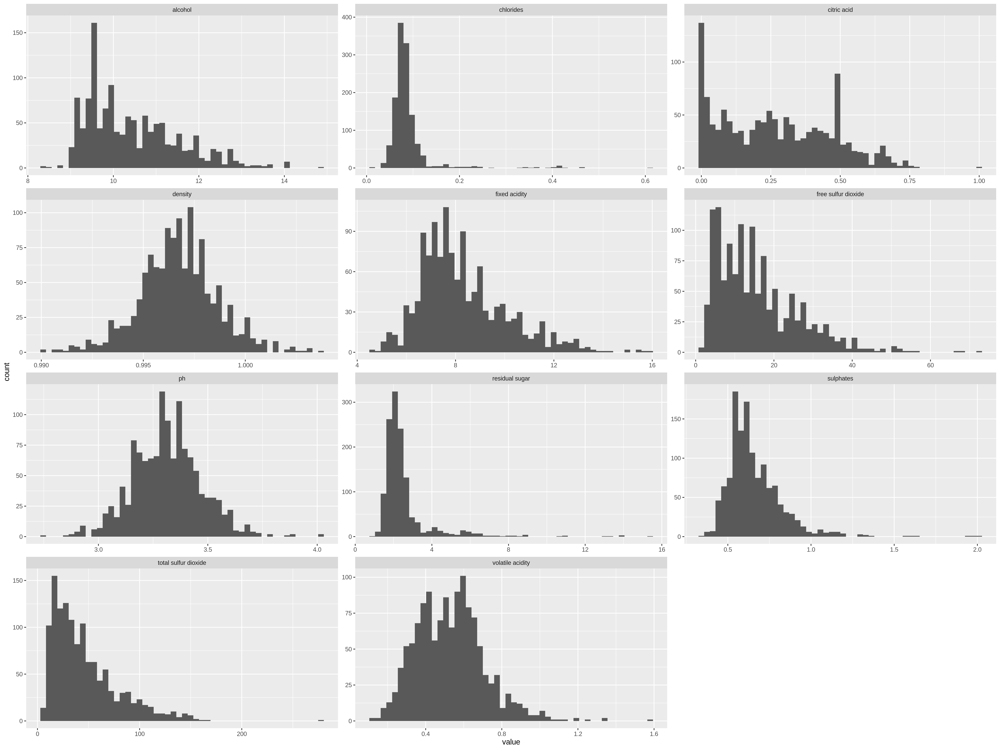
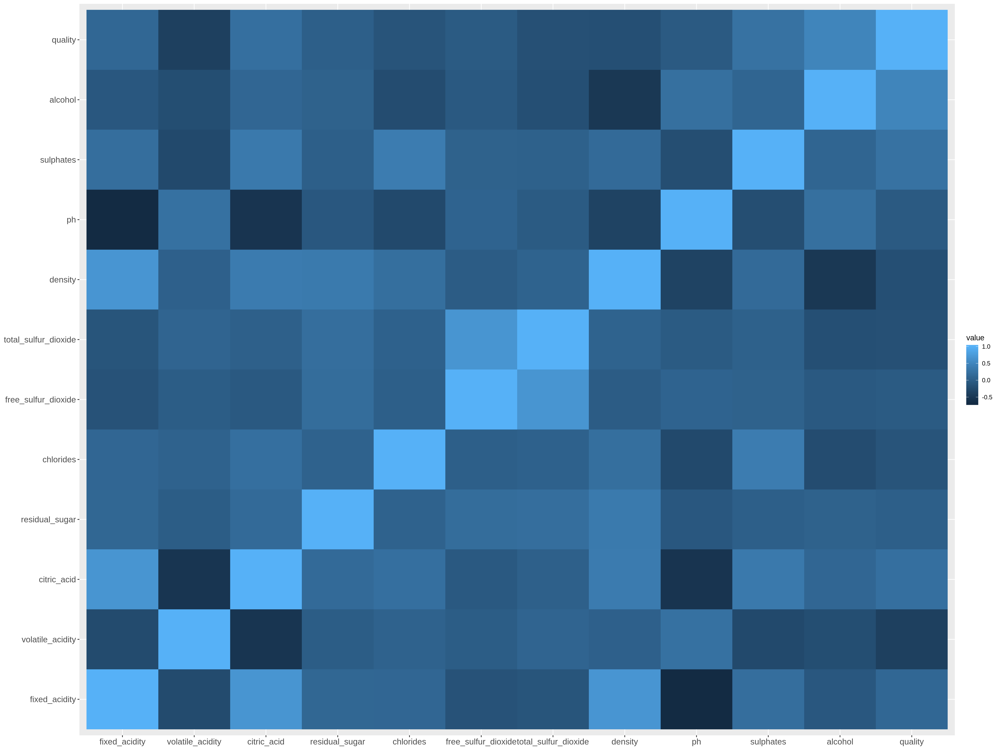

```{r setup, include=FALSE}
knitr::opts_chunk$set(echo = FALSE, warning = FALSE, message=FALSE)
library(tidyverse)
library(knitr)
library(caret)
library(janitor)
library(reshape2)
library(viridis)
set.seed(2020)
```

## Summary of the data set

This dataset is about red variants of the Portuguese "Vinho Verde" wine. For more details, consult the reference [Cortez et al., 2009]. It was provided on [Kaggle](https://www.kaggle.com/uciml/red-wine-quality-cortez-et-al-2009), but it was originally sourced from the [UCI Machine Learning Repository](https://archive.ics.uci.edu/ml/datasets/Wine+Quality).

Each row in the data set represents several metrics of a certain red wine gained from its physicochemical tests such as acidity, sugar, chlorides, sulfur dioxide and alcohol etc.  The last column for each row represents the quality score. A wine's quality score is measured by sensors, which is score from 0 to 10, with 0 being the lowest and 10 being the highest. We will build a model to discover the relationship between the physicochemical measurements and quality score. There are 1599 observations in the data set, and 11 features. There are 0 observations with missing values in the data set.

``` {r load data}
df <- read_csv('../data/raw/red_wine.csv')
df <- clean_names(df)
```

## Partition the data set into training and test sets
We will split the data into the training set with 75% of observations and test set with 25% of observations. Below are the counts of observations for each class:

```{r partition}
# split into training and test data sets
training_rows <- df %>% 
    mutate(quality = as.factor(quality)) %>% 
    select(quality) %>% 
    pull() %>% 
    createDataPartition(p = 0.8, list = FALSE)

training_data <- df %>% slice(training_rows)
test_data <- df %>% slice(-training_rows)

train_counts <- summarise(training_data, `Data partition` = "Training set",
                          `0` = sum(quality  == "0"),
                          `1` = sum(quality  == "1"), 
                          `2` = sum(quality  == "2"),
                          `3` = sum(quality  == "3"), 
                          `4` = sum(quality  == "4"),
                          `5` = sum(quality  == "5"), 
                          `6` = sum(quality  == "6"),
                          `7` = sum(quality  == "7"), 
                          `8` = sum(quality  == "8"),
                          `9` = sum(quality  == "9"))
kable(train_counts,
      caption = "Table 1. Counts of observation for each quality.")
```

```{r quality value distribution, echo=FALSE, fig.cap="Figure 1. Distribution of training set targets(y).", out.width = '100%'}

```

The quality classes of red wines are very **imbalanced**, this is definitely something we want to pay attention to. Most wines are among the middle classes(5 to 7), very few wines than excellent(class 8) or poor ones(class 3,4).

## Exploratory analysis on the training data set

### Distributions of all features

```{r distributions of all features, echo=FALSE, fig.cap="Figure 2. Distribution of all features in the training set.", out.width = '100%'}

```

The histograms of all the features do not show any anomaly here.

### Correlation between features
```{r heatmap, echo=FALSE, fig.cap="Figure 3. Correlation heatmap between features.", out.width = '100%'}

```

From the heatmap, I can see the following combinations of features are positive related:
    
1. `fixed_acidity` and `citric_acid`
2. `fixed_acidity` and `density`
3. `total_sulfur_dioxide` and `free_sulfur_dioxide`

For some chemical reasons, these three sets of features are highly correlated, and we definitely need to be aware of this when building our machine learning model.